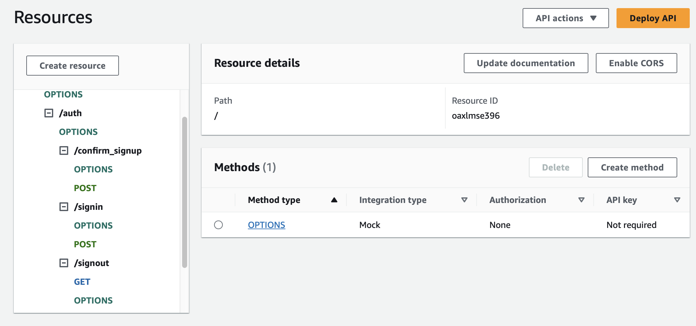
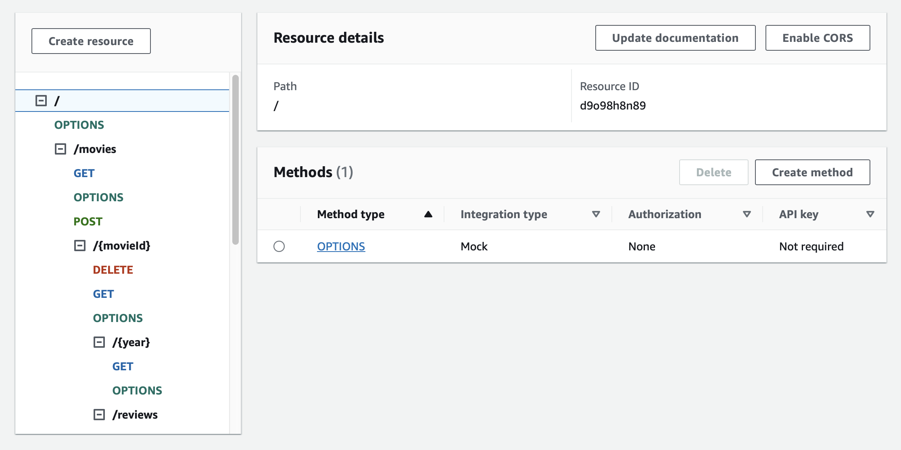
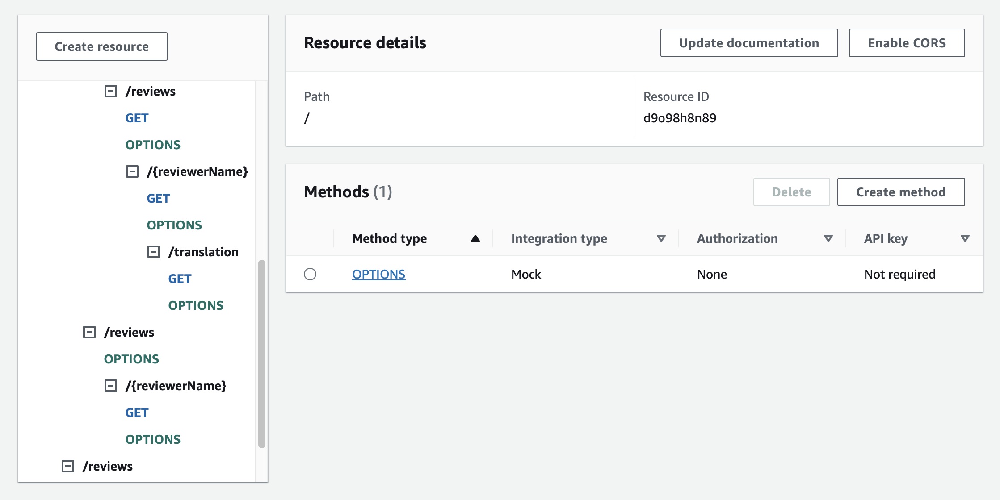
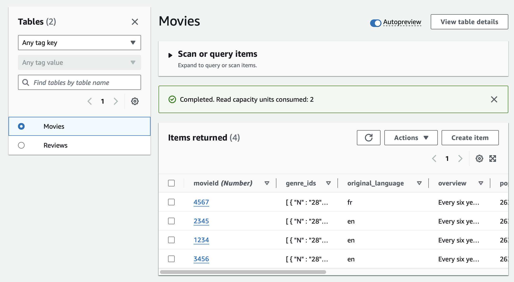
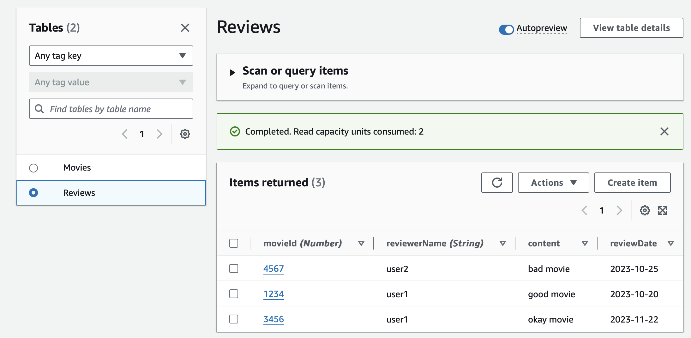
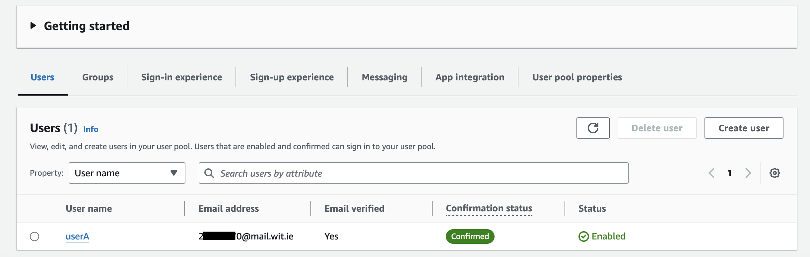

## ServerlessREST Sddignment - Distributed Systems.

__Name:__ Dean Lonergan

This repository contains the implementation of a serverless REST API for the AWS platform. A CDK stack creates the infrastructure. The domain context of the API is movie reviews.

### API endpoints.
 
+ POST /movies/reviews - add a movie review.
- [x] Implemented*
- [ ] Recorded

+ GET /movies/{movieId}/reviews - Get all the reviews for a movie with the specified id.
- [x] Implemented
- [x] Recorded

+ GET /movies/{movieId}/reviews?minRating=n - Get all the reviews for the movie with the specified ID with a rating greater than the minRating.
- [ ] Implemented
- [ ] Recorded

+ GET /movies/{movieId}/reviews/{reviewerName} - Get the review for the movie with the specified movie ID and written by the named reviewer.
- [x] Implemented
- [x] Recorded

+ GET /movies/{movieId}/reviews/{year} - Get the review(s) for the movie with the specified movie ID and were written in a specified year.
- [x] Implemented*
- [ ] Recorded

+ GET /movies/reviews/{reviewerName} - Get all the reviews written by a specific reviewer.
- [x] Implemented
- [x] Recorded

+ GET /movies/{movieId}/reviews/{reviewerName}/translation?language=code - Get a translated version of the review for the movie with the specified movie ID and written by the named reviewer.
- [x] Implemented*
- [ ] Recorded

+ Auth API

+ Rest API

+ Movies table

+ Reviews table

### Authentication..

- [x] Implemented
- [x] Recorded

### Independent learning (If relevant).

Made an attempt at the translation API. Made use of the following:
https://completecoding.io/typescript-translation-api/
https://docs.aws.amazon.com/translate/latest/dg/what-is.html
